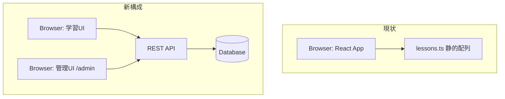

# フルスタック化 設計相談メモ

日付: 2026-04-17

## 相談概要

レッスン情報をDBで保持するように機能追加したい。
- 目的: レッスンを管理画面から動的に追加・編集できるようにする
- 認証機能: 現状は不要

---

## 状況の整理

```
目的: レッスンを管理画面から動的に追加・編集できるようにする
課題: 現状は lessons.ts のハードコードのみ。動的変更不可
制約: 認証不要、既存 Vite+React+TS 構成を維持
判断ポイント: バックエンド技術スタックの選定
```

---

## 現状 vs 新アーキテクチャ



---

## 案A：最新技術スタック

| 層 | 技術 | 理由 |
|---|---|---|
| Runtime | **Bun** | Node互換・TypeScript native・高速 |
| Framework | **Hono v4** | Web Standards準拠・超軽量・TS-first |
| ORM | **Drizzle ORM** | 型安全・SQLに近い直感的な記法 |
| DB | **Turso**（libSQL） | エッジ対応・分散SQLite・無料枠あり |
| Deploy | Fly.io / Cloudflare Workers | エッジ実行可能 |

**特徴:** 全てTypeScript native。エッジ環境での実行を前提とした設計。

---

## 案B：最適スタック（推奨）

| 層 | 技術 | 理由 |
|---|---|---|
| Runtime | **Node.js** | 安定・エコシステム最大 |
| Framework | **Hono v4** | 軽量・Express比で高速・TS親和性高 |
| ORM | **Prisma** | マイグレーション管理・DX最良・ドキュメント豊富 |
| DB | **PostgreSQL** | 既存 Docker Compose に追加するだけ |
| Deploy | **Docker Compose 拡張** | 既存インフラ流用 |

**特徴:** 既存構成への変更を最小化。チーム開発での安定性重視。

---

## トレードオフ比較

| 観点 | 案A（最新） | 案B（最適） |
|---|---|---|
| 学習コスト | 高（Bun/Drizzle/Turso は情報少） | 低（Prisma/PostgreSQL は資料豊富） |
| 既存環境との親和性 | 低（新規インフラ必要） | **高（Docker Compose 拡張）** |
| マイグレーション管理 | Drizzleは手動寄り | **Prismaは自動生成・管理が楽** |
| エッジ対応 | 可能 | 不要（学習サイト規模） |
| 本番安定性 | やや未知数 | **実績豊富** |
| 開発体験（DX） | 高（最新ツール） | **高（Prisma Studio等）** |

---

## 推奨：案B（Hono + Prisma + PostgreSQL）

**理由:** 学習サイト規模ではエッジ性能は不要。Prismaのマイグレーション管理とPrisma Studioによる管理UIは、チーム開発での反復開発に最適。既存のDocker Compose構成を拡張するだけで済み、インフラ変更コストが最小。

**前提条件:** Fly.io等のクラウドデプロイが不要で、Docker環境で運用する場合。

**リスク:** Prismaはスキーマ変更のたびにマイグレーションファイル生成が必要。手順を守れば問題なし。

---

## 次のアクション（優先順）

1. **DBスキーマ設計** — `lessons`テーブルの列定義（現状の`Lesson`型を参考に）
2. **Docker Compose拡張** — PostgreSQL コンテナ追加
3. **Honoバックエンド構築** — `/api/lessons` のCRUDエンドポイント実装
4. **フロントエンド修正** — `lessons.ts`静的データ → APIフェッチに切替
5. **管理UI実装** — `/admin` ページ（レッスン一覧・追加・編集・削除）
